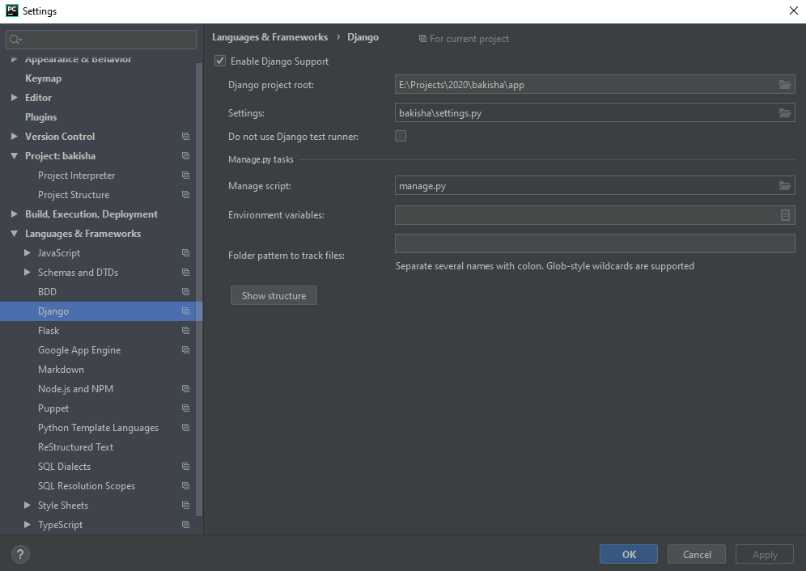
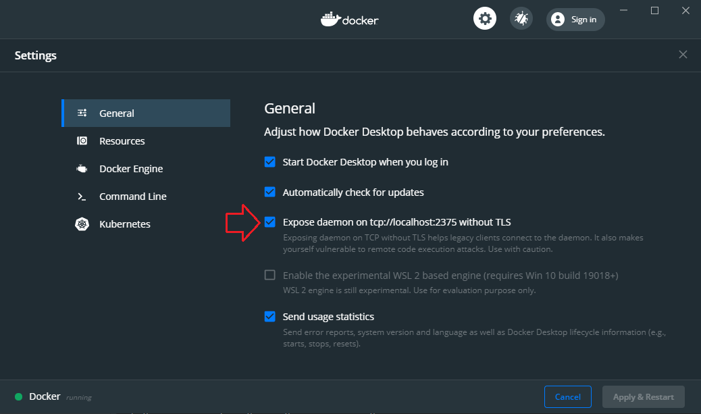
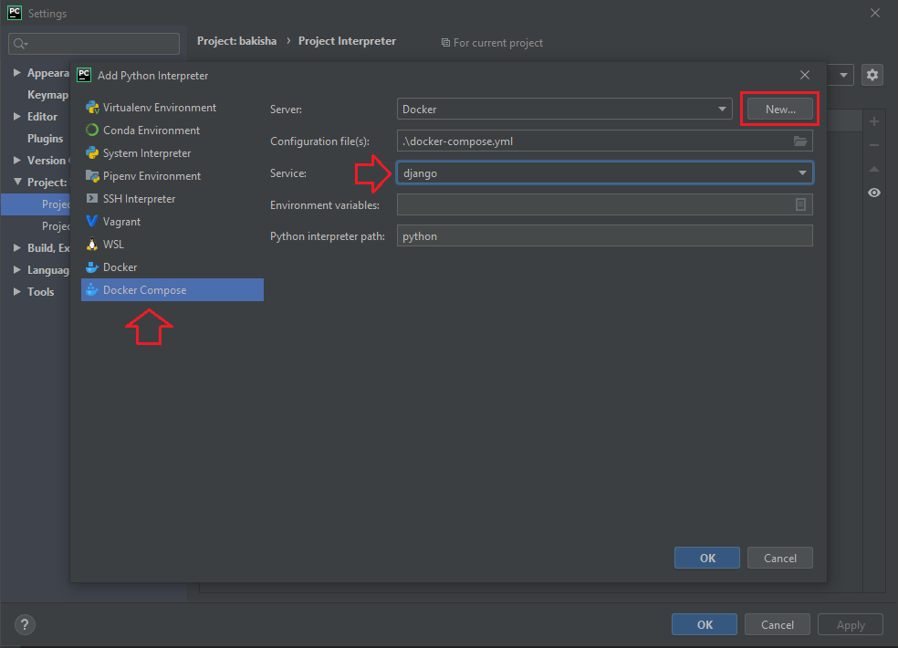
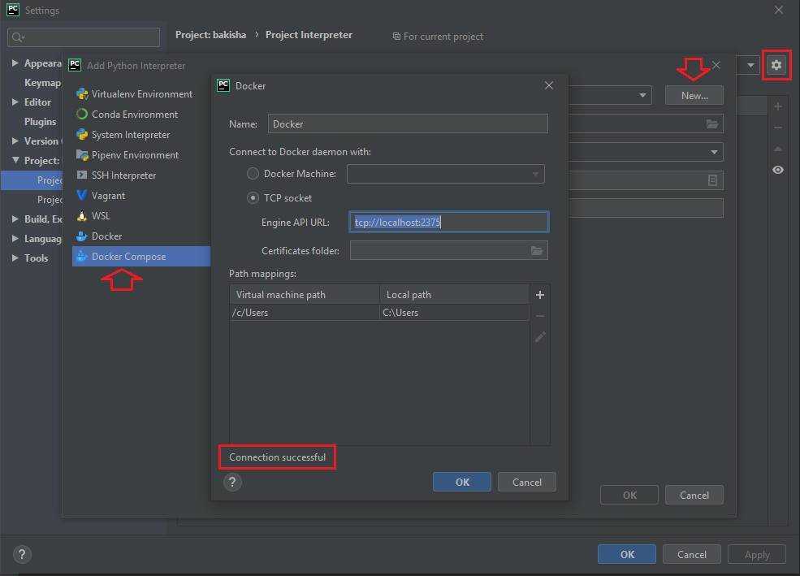
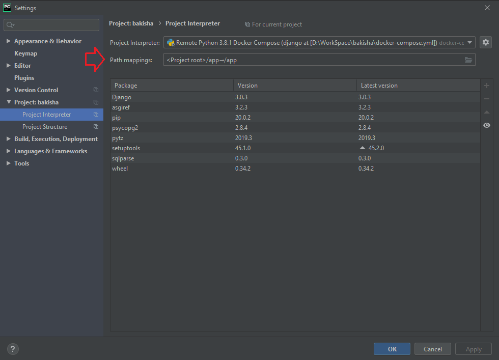
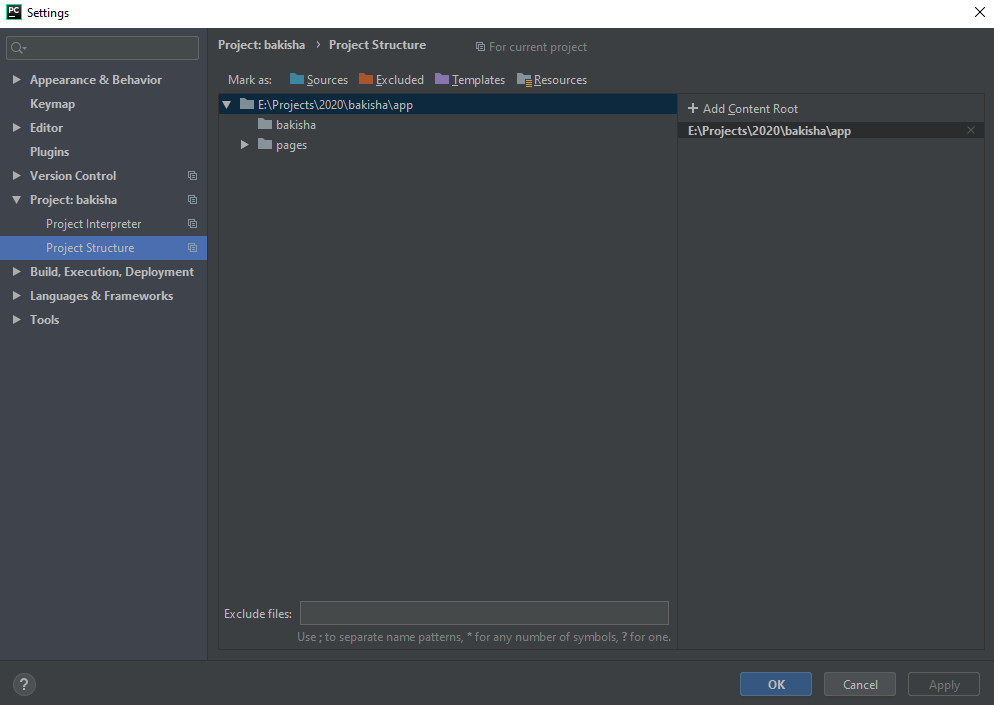
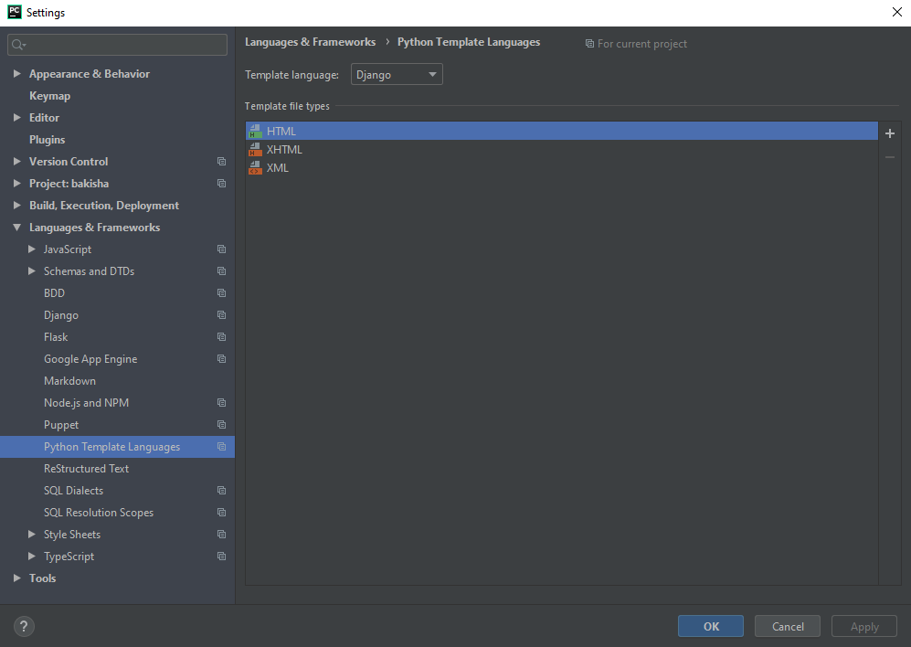

## PyCharm Configuration

**NOTE:** Most of these settings were configured using PyCharm **Professional**.

### Django Settings

1. Go to File > Settings (CTR + ALT + S) > Language & Frameworks > Django
2. Check the `Enable Django Support` checkbox
3. Map `Django project root` directory and `Settings` file
4. Define `Manage script`
5. Click `Apply` 

 

### Remote Project Interpreter

**NOTE:** In order to setup the remote project interpreter coming from docker container, you will have to
expose docker daemon on tcp://localhost:2375 without TLS.

 

1. Go to File > Settings (CTR + ALT + S) > Project: Bakisha > Project Interpreter
2. Click on the far right button next to the `Project Interpreter` and choose `Add new`
3. Choose `Docker Compose` int left menu
4. Under the `Service`git  select `django` and click on `New...` in the top right corner of the popup window
5. Check the `TCP socket` under the `Connect to Docker daemon with:` and put `tcp://localhost:2375`
under the `Engine API URL:`
6. Make sure that `Connection successful` is displayed in the bottom left corner of the popup window
and click `OK`
7. Now, go to Go to File > Settings (CTR + ALT + S) > Project: Bakisha > Project Interpreter and setup `Path
mapping:` - `Local path` should be `/project/location/on/local/machine/bakisha/app` and `Remote path` should
be just `/app`
8. Click `Apply`

 

### Project Structure

1. Go to File > Settings (CTR + ALT + S) > Project: Bakisha > Project Structure
2. If there is any content root, remove it and click on `Add Content Root`
3. Go to the location of the project on your local machine and chose `/bakisha/app` as the content root
4. Click `Apply`

 

### Python Template Language

1. Go to File > Settings (CTR + ALT + S) > Language & Frameworks > Python Template Language
2. Choose `Django` under the `Template Language`
4. Click `Apply`
 

